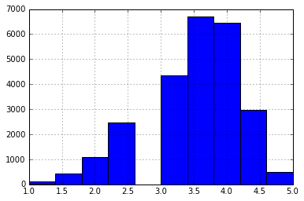
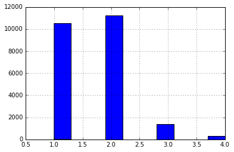
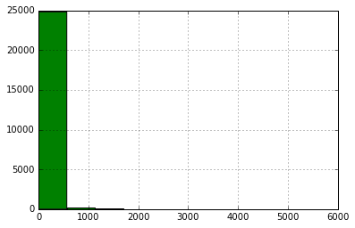

```python
# -*- coding: utf-8 -*-
"""Convert the Yelp Dataset Challenge dataset from json format to csv.

For more information on the Yelp Dataset Challenge please visit http://yelp.com/dataset_challenge

"""
import argparse
import collections
import csv
import simplejson as json


def read_and_write_file(json_file_path, csv_file_path, column_names):
    """Read in the json dataset file and write it out to a csv file, given the column names."""
    with open(csv_file_path, 'wb+') as fout:
        csv_file = csv.writer(fout)
        csv_file.writerow(list(column_names))
        with open(json_file_path) as fin:
            for line in fin:
                line_contents = json.loads(line)
                csv_file.writerow(get_row(line_contents, column_names))

def read_and_write_file_by_category(json_file_path, csv_file_path, column_names, category_name):
    """Read in the json dataset file and write it out to a csv file, given the column names."""
    with open(csv_file_path, 'wb+') as fout:
        csv_file = csv.writer(fout)
        csv_file.writerow(list(column_names))
        if "categories" not in list(column_names):
            # print "No column named category"
            return
        with open(json_file_path) as fin:
            for line in fin:
                line_contents = json.loads(line)
                if category_name in line_contents["categories"]:
                    csv_file.writerow(get_row(line_contents, column_names))

def get_superset_of_column_names_from_file(json_file_path):
    """Read in the json dataset file and return the superset of column names."""
    column_names = set()
    with open(json_file_path) as fin:
        for line in fin:
            line_contents = json.loads(line)
            column_names.update(
                    set(get_column_names(line_contents).keys())
                    )
    return column_names

def get_column_names(line_contents, parent_key=''):
    """Return a list of flattened key names given a dict.

    Example:

        line_contents = {
            'a': {
                'b': 2,
                'c': 3,
                },
        }

        will return: ['a.b', 'a.c']

    These will be the column names for the eventual csv file.

    """
    column_names = []
    for k, v in line_contents.iteritems():
        column_name = "{0}.{1}".format(parent_key, k) if parent_key else k
        if isinstance(v, collections.MutableMapping):
            column_names.extend(
                    get_column_names(v, column_name).items()
                    )
        else:
            column_names.append((column_name, v))
    return dict(column_names)

def get_nested_value(d, key):
    """Return a dictionary item given a dictionary `d` and a flattened key from `get_column_names`.
    
    Example:

        d = {
            'a': {
                'b': 2,
                'c': 3,
                },
        }
        key = 'a.b'

        will return: 2
    
    """
    if '.' not in key:
        if key not in d:
            return None
        return d[key]
    base_key, sub_key = key.split('.', 1)
    if base_key not in d:
        return None
    sub_dict = d[base_key]
    return get_nested_value(sub_dict, sub_key)

def get_row(line_contents, column_names):
    """Return a csv compatible row given column names and a dict."""
    row = []
    for column_name in column_names:
        line_value = get_nested_value(
                        line_contents,
                        column_name,
                        )
        if isinstance(line_value, unicode):
            row.append('{0}'.format(line_value.encode('utf-8')))
        elif line_value is not None:
            row.append('{0}'.format(line_value))
        else:
            row.append('')
    return row

if __name__ == '__main__':
    """Convert a yelp dataset file from json to csv."""

    parser = argparse.ArgumentParser(
            description='Convert Yelp Dataset Challenge data from JSON format to CSV.',
            )

    parser.add_argument(
            'json_file',
            type=str,
            default='../dataset/yelp_academic_dataset_business.json',
            help='The json file to convert.',
            )
    parser.add_argument(
        'category_name',
        type = str,
        default= "Restaurants",
        help = "Category Name"
    )
#     args = parser.parse_args()

#     json_file = args.json_file
    json_file = '../dataset/yelp_academic_dataset_business.json'
#     csv_file = '{0}.csv'.format(json_file.split('.json')[0])
    csv_file = 'Restaurant.csv'
#     category_name = args.category_name
    category_name = "Restaurants"
    column_names = get_superset_of_column_names_from_file(json_file)

    read_and_write_file_by_category(json_file, csv_file, column_names, category_name)

```


```python
""" Converting our csv data to numpy array. Makes life easier"""
import csv
import numpy as np

csv_reader = csv.reader(open('Restaurant.csv', 'rb'))
header = csv_reader.next()
data = []

for row in csv_reader:
    data.append(row)

data = np.array(data)
```


```python
""" Using pandas to get an idea about the data"""
import pandas as pd

df = pd.read_csv('Restaurant.csv', header=0)

```

    /home/geekineer/anaconda2/lib/python2.7/site-packages/IPython/core/interactiveshell.py:2723: DtypeWarning: Columns (1,4,7,13,17,26,29,49,60,62,77,79,86,94) have mixed types. Specify dtype option on import or set low_memory=False.
      interactivity=interactivity, compiler=compiler, result=result)


```python
# Checking if it worked
df.head(5)
```


<div>
<table border="1" class="dataframe">
  <thead>
    <tr style="text-align: right;">
      <th></th>
      <th>attributes.Ambience.divey</th>
      <th>attributes.Dietary Restrictions.vegan</th>
      <th>attributes.Happy Hour</th>
      <th>hours.Thursday.open</th>
      <th>attributes.Order at Counter</th>
      <th>attributes.Hair Types Specialized In.africanamerican</th>
      <th>attributes.Hair Types Specialized In.kids</th>
      <th>attributes.BYOB</th>
      <th>hours.Friday.open</th>
      <th>attributes.Good For.latenight</th>
      <th>...</th>
      <th>attributes.Noise Level</th>
      <th>attributes.Smoking</th>
      <th>attributes.Attire</th>
      <th>attributes.Hair Types Specialized In.curly</th>
      <th>attributes.Good For Groups</th>
      <th>neighborhoods</th>
      <th>attributes.Open 24 Hours</th>
      <th>attributes.Ambience.romantic</th>
      <th>attributes.Music.jukebox</th>
      <th>attributes.Ambience.upscale</th>
    </tr>
  </thead>
  <tbody>
    <tr>
      <th>0</th>
      <td>False</td>
      <td>NaN</td>
      <td>NaN</td>
      <td>11:00</td>
      <td>NaN</td>
      <td>NaN</td>
      <td>NaN</td>
      <td>NaN</td>
      <td>11:00</td>
      <td>False</td>
      <td>...</td>
      <td>average</td>
      <td>NaN</td>
      <td>casual</td>
      <td>NaN</td>
      <td>True</td>
      <td>[]</td>
      <td>NaN</td>
      <td>False</td>
      <td>NaN</td>
      <td>False</td>
    </tr>
    <tr>
      <th>1</th>
      <td>False</td>
      <td>NaN</td>
      <td>False</td>
      <td>10:00</td>
      <td>NaN</td>
      <td>NaN</td>
      <td>NaN</td>
      <td>NaN</td>
      <td>10:00</td>
      <td>False</td>
      <td>...</td>
      <td>average</td>
      <td>no</td>
      <td>casual</td>
      <td>NaN</td>
      <td>True</td>
      <td>[]</td>
      <td>NaN</td>
      <td>False</td>
      <td>NaN</td>
      <td>False</td>
    </tr>
    <tr>
      <th>2</th>
      <td>False</td>
      <td>NaN</td>
      <td>True</td>
      <td>11:00</td>
      <td>NaN</td>
      <td>NaN</td>
      <td>NaN</td>
      <td>NaN</td>
      <td>11:00</td>
      <td>False</td>
      <td>...</td>
      <td>loud</td>
      <td>outdoor</td>
      <td>casual</td>
      <td>NaN</td>
      <td>True</td>
      <td>['Greentree']</td>
      <td>NaN</td>
      <td>False</td>
      <td>NaN</td>
      <td>False</td>
    </tr>
    <tr>
      <th>3</th>
      <td>NaN</td>
      <td>NaN</td>
      <td>NaN</td>
      <td>08:00</td>
      <td>NaN</td>
      <td>NaN</td>
      <td>NaN</td>
      <td>NaN</td>
      <td>08:00</td>
      <td>False</td>
      <td>...</td>
      <td>NaN</td>
      <td>NaN</td>
      <td>casual</td>
      <td>NaN</td>
      <td>True</td>
      <td>[]</td>
      <td>NaN</td>
      <td>NaN</td>
      <td>NaN</td>
      <td>NaN</td>
    </tr>
    <tr>
      <th>4</th>
      <td>False</td>
      <td>NaN</td>
      <td>NaN</td>
      <td>11:00</td>
      <td>NaN</td>
      <td>NaN</td>
      <td>NaN</td>
      <td>NaN</td>
      <td>11:00</td>
      <td>False</td>
      <td>...</td>
      <td>average</td>
      <td>no</td>
      <td>casual</td>
      <td>NaN</td>
      <td>True</td>
      <td>[]</td>
      <td>NaN</td>
      <td>False</td>
      <td>NaN</td>
      <td>False</td>
    </tr>
  </tbody>
</table>
<p>5 rows × 98 columns</p>
</div>


```python
"""Lets look at column datatypes"""
df.dtypes
```


    attributes.Ambience.divey                                object
    attributes.Dietary Restrictions.vegan                    object
    attributes.Happy Hour                                    object
    hours.Thursday.open                                      object
    attributes.Order at Counter                              object
    attributes.Hair Types Specialized In.africanamerican    float64
    attributes.Hair Types Specialized In.kids               float64
    attributes.BYOB                                          object
    hours.Friday.open                                        object
    attributes.Good For.latenight                            object
    attributes.Outdoor Seating                               object
    attributes.Alcohol                                       object
    attributes.Ambience.classy                               object
    attributes.By Appointment Only                           object
    attributes.Parking.lot                                   object
    business_id                                              object
    attributes.Ambience.touristy                             object
    attributes.Corkage                                       object
    hours.Tuesday.open                                       object
    attributes.Good For.brunch                               object
    categories                                               object
    attributes.Waiter Service                                object
    hours.Monday.open                                        object
    name                                                     object
    attributes.Parking.street                                object
    attributes.Ambience.hipster                              object
    attributes.BYOB/Corkage                                  object
    attributes.Hair Types Specialized In.straightperms      float64
    attributes.Music.live                                    object
    attributes.Dietary Restrictions.dairy-free               object
                                                             ...   
    attributes.Coat Check                                    object
    longitude                                               float64
    hours.Monday.close                                       object
    attributes.Hair Types Specialized In.extensions         float64
    hours.Tuesday.close                                      object
    hours.Saturday.close                                     object
    attributes.Good for Kids                                 object
    attributes.Parking.validated                             object
    hours.Sunday.open                                        object
    attributes.Accepts Insurance                             object
    attributes.Music.dj                                      object
    attributes.Dietary Restrictions.soy-free                 object
    attributes.Has TV                                        object
    hours.Sunday.close                                       object
    attributes.Ambience.casual                               object
    attributes.Hair Types Specialized In.perms              float64
    attributes.Dogs Allowed                                  object
    attributes.Drive-Thru                                    object
    attributes.Dietary Restrictions.vegetarian               object
    hours.Wednesday.open                                     object
    attributes.Noise Level                                   object
    attributes.Smoking                                       object
    attributes.Attire                                        object
    attributes.Hair Types Specialized In.curly              float64
    attributes.Good For Groups                               object
    neighborhoods                                            object
    attributes.Open 24 Hours                                 object
    attributes.Ambience.romantic                             object
    attributes.Music.jukebox                                 object
    attributes.Ambience.upscale                              object
    dtype: object


```python
"""Lot of objects. Not Good"""

df.info()
```

    <class 'pandas.core.frame.DataFrame'>
    Int64Index: 25071 entries, 0 to 25070
    Data columns (total 98 columns):
    attributes.Ambience.divey                               18548 non-null object
    attributes.Dietary Restrictions.vegan                   147 non-null object
    attributes.Happy Hour                                   2383 non-null object
    hours.Thursday.open                                     16162 non-null object
    attributes.Order at Counter                             366 non-null object
    attributes.Hair Types Specialized In.africanamerican    0 non-null float64
    attributes.Hair Types Specialized In.kids               0 non-null float64
    attributes.BYOB                                         831 non-null object
    hours.Friday.open                                       16192 non-null object
    attributes.Good For.latenight                           21509 non-null object
    attributes.Outdoor Seating                              22253 non-null object
    attributes.Alcohol                                      20531 non-null object
    attributes.Ambience.classy                              19136 non-null object
    attributes.By Appointment Only                          26 non-null object
    attributes.Parking.lot                                  20796 non-null object
    business_id                                             25071 non-null object
    attributes.Ambience.touristy                            19136 non-null object
    attributes.Corkage                                      619 non-null object
    hours.Tuesday.open                                      15853 non-null object
    attributes.Good For.brunch                              21456 non-null object
    categories                                              25071 non-null object
    attributes.Waiter Service                               20769 non-null object
    hours.Monday.open                                       14738 non-null object
    name                                                    25071 non-null object
    attributes.Parking.street                               20796 non-null object
    attributes.Ambience.hipster                             19012 non-null object
    attributes.BYOB/Corkage                                 1291 non-null object
    attributes.Hair Types Specialized In.straightperms      0 non-null float64
    attributes.Music.live                                   1267 non-null object
    attributes.Dietary Restrictions.dairy-free              147 non-null object
    attributes.Music.background_music                       861 non-null object
    attributes.Price Range                                  23404 non-null float64
    attributes.Good For.breakfast                           21517 non-null object
    attributes.Parking.garage                               20798 non-null object
    attributes.Music.karaoke                                873 non-null object
    attributes.Good For Dancing                             2326 non-null object
    review_count                                            25071 non-null int64
    attributes.Hair Types Specialized In.asian              0 non-null float64
    state                                                   25070 non-null object
    attributes.Accepts Credit Cards                         23547 non-null object
    hours.Friday.close                                      16192 non-null object
    attributes.Good For.lunch                               21509 non-null object
    attributes.Parking.valet                                20796 non-null object
    attributes.Take-out                                     22919 non-null object
    full_address                                            25071 non-null object
    hours.Thursday.close                                    16162 non-null object
    attributes.Hair Types Specialized In.coloring           0 non-null float64
    attributes.Good For.dessert                             21454 non-null object
    attributes.Music.video                                  1173 non-null object
    attributes.Dietary Restrictions.halal                   147 non-null object
    attributes.Takes Reservations                           22370 non-null object
    hours.Saturday.open                                     15792 non-null object
    attributes.Ages Allowed                                 27 non-null object
    attributes.Ambience.trendy                              19136 non-null object
    attributes.Delivery                                     22325 non-null object
    hours.Wednesday.close                                   16104 non-null object
    attributes.Wi-Fi                                        16983 non-null object
    open                                                    25071 non-null bool
    city                                                    25071 non-null object
    attributes.Wheelchair Accessible                        11574 non-null object
    attributes.Dietary Restrictions.gluten-free             147 non-null object
    stars                                                   25071 non-null float64
    attributes.Dietary Restrictions.kosher                  147 non-null object
    type                                                    25071 non-null object
    attributes.Caters                                       15398 non-null object
    attributes.Ambience.intimate                            19136 non-null object
    latitude                                                25071 non-null float64
    attributes.Good For.dinner                              21509 non-null object
    attributes.Coat Check                                   2266 non-null object
    longitude                                               25071 non-null float64
    hours.Monday.close                                      14738 non-null object
    attributes.Hair Types Specialized In.extensions         0 non-null float64
    hours.Tuesday.close                                     15853 non-null object
    hours.Saturday.close                                    15792 non-null object
    attributes.Good for Kids                                22801 non-null object
    attributes.Parking.validated                            20597 non-null object
    hours.Sunday.open                                       13684 non-null object
    attributes.Accepts Insurance                            2 non-null object
    attributes.Music.dj                                     1869 non-null object
    attributes.Dietary Restrictions.soy-free                147 non-null object
    attributes.Has TV                                       20216 non-null object
    hours.Sunday.close                                      13684 non-null object
    attributes.Ambience.casual                              19136 non-null object
    attributes.Hair Types Specialized In.perms              0 non-null float64
    attributes.Dogs Allowed                                 2459 non-null object
    attributes.Drive-Thru                                   3302 non-null object
    attributes.Dietary Restrictions.vegetarian              147 non-null object
    hours.Wednesday.open                                    16104 non-null object
    attributes.Noise Level                                  19086 non-null object
    attributes.Smoking                                      2603 non-null object
    attributes.Attire                                       22779 non-null object
    attributes.Hair Types Specialized In.curly              0 non-null float64
    attributes.Good For Groups                              23052 non-null object
    neighborhoods                                           25071 non-null object
    attributes.Open 24 Hours                                241 non-null object
    attributes.Ambience.romantic                            19136 non-null object
    attributes.Music.jukebox                                1281 non-null object
    attributes.Ambience.upscale                             19029 non-null object
    dtypes: bool(1), float64(12), int64(1), object(84)
    memory usage: 18.8+ MB


```python
""" Checking number of rows"""

len(df.index)
```


    25071


```python
""" Calculate mean, stddev, min, max and all good stuff :)"""

df.describe()
```


<div>
<table border="1" class="dataframe">
  <thead>
    <tr style="text-align: right;">
      <th></th>
      <th>attributes.Hair Types Specialized In.africanamerican</th>
      <th>attributes.Hair Types Specialized In.kids</th>
      <th>attributes.Hair Types Specialized In.straightperms</th>
      <th>attributes.Price Range</th>
      <th>review_count</th>
      <th>attributes.Hair Types Specialized In.asian</th>
      <th>attributes.Hair Types Specialized In.coloring</th>
      <th>open</th>
      <th>stars</th>
      <th>latitude</th>
      <th>longitude</th>
      <th>attributes.Hair Types Specialized In.extensions</th>
      <th>attributes.Hair Types Specialized In.perms</th>
      <th>attributes.Hair Types Specialized In.curly</th>
    </tr>
  </thead>
  <tbody>
    <tr>
      <th>count</th>
      <td>0</td>
      <td>0</td>
      <td>0</td>
      <td>23404.000000</td>
      <td>25071.000000</td>
      <td>0</td>
      <td>0</td>
      <td>25071</td>
      <td>25071.000000</td>
      <td>25071.000000</td>
      <td>25071.000000</td>
      <td>0</td>
      <td>0</td>
      <td>0</td>
    </tr>
    <tr>
      <th>mean</th>
      <td>NaN</td>
      <td>NaN</td>
      <td>NaN</td>
      <td>1.634934</td>
      <td>59.552870</td>
      <td>NaN</td>
      <td>NaN</td>
      <td>0.773483</td>
      <td>3.482111</td>
      <td>38.246153</td>
      <td>-93.143806</td>
      <td>NaN</td>
      <td>NaN</td>
      <td>NaN</td>
    </tr>
    <tr>
      <th>std</th>
      <td>NaN</td>
      <td>NaN</td>
      <td>NaN</td>
      <td>0.650694</td>
      <td>145.586088</td>
      <td>NaN</td>
      <td>NaN</td>
      <td>0.418586</td>
      <td>0.749531</td>
      <td>6.046039</td>
      <td>30.895755</td>
      <td>NaN</td>
      <td>NaN</td>
      <td>NaN</td>
    </tr>
    <tr>
      <th>min</th>
      <td>NaN</td>
      <td>NaN</td>
      <td>NaN</td>
      <td>1.000000</td>
      <td>3.000000</td>
      <td>NaN</td>
      <td>NaN</td>
      <td>False</td>
      <td>1.000000</td>
      <td>32.876619</td>
      <td>-115.351900</td>
      <td>NaN</td>
      <td>NaN</td>
      <td>NaN</td>
    </tr>
    <tr>
      <th>25%</th>
      <td>NaN</td>
      <td>NaN</td>
      <td>NaN</td>
      <td>1.000000</td>
      <td>7.000000</td>
      <td>NaN</td>
      <td>NaN</td>
      <td>1</td>
      <td>3.000000</td>
      <td>33.565818</td>
      <td>-112.273268</td>
      <td>NaN</td>
      <td>NaN</td>
      <td>NaN</td>
    </tr>
    <tr>
      <th>50%</th>
      <td>NaN</td>
      <td>NaN</td>
      <td>NaN</td>
      <td>2.000000</td>
      <td>19.000000</td>
      <td>NaN</td>
      <td>NaN</td>
      <td>1</td>
      <td>3.500000</td>
      <td>36.071196</td>
      <td>-111.869777</td>
      <td>NaN</td>
      <td>NaN</td>
      <td>NaN</td>
    </tr>
    <tr>
      <th>75%</th>
      <td>NaN</td>
      <td>NaN</td>
      <td>NaN</td>
      <td>2.000000</td>
      <td>58.000000</td>
      <td>NaN</td>
      <td>NaN</td>
      <td>1</td>
      <td>4.000000</td>
      <td>43.014543</td>
      <td>-80.044475</td>
      <td>NaN</td>
      <td>NaN</td>
      <td>NaN</td>
    </tr>
    <tr>
      <th>max</th>
      <td>NaN</td>
      <td>NaN</td>
      <td>NaN</td>
      <td>4.000000</td>
      <td>5642.000000</td>
      <td>NaN</td>
      <td>NaN</td>
      <td>True</td>
      <td>5.000000</td>
      <td>56.036545</td>
      <td>8.549249</td>
      <td>NaN</td>
      <td>NaN</td>
      <td>NaN</td>
    </tr>
  </tbody>
</table>
</div>


```python
""" Histogram of review stars"""
%matplotlib inline
import pylab as plot

df.stars.hist()

```


    <matplotlib.axes._subplots.AxesSubplot at 0x7fb7fc196150>





```python
""" EVery column is throwing unhashable exception. Need to fill missing values using impute/fillna :("""
from sklearn.cross_validation import cross_val_score, ShuffleSplit
from sklearn.ensemble import RandomForestRegressor

data_columns = set(list(df)) - set(['stars'])
X = df[list(data_columns)]
Y = df["stars"]
names = list(df)
 
rf = RandomForestRegressor(n_estimators=20, max_depth=4)
scores = []
for i in range(X.shape[1]):
    try:
     score = cross_val_score(rf, X[:, i:i+1], Y, scoring="r2",
                              cv=ShuffleSplit(len(X), 3, .3))
     scores.append((round(np.mean(score), 3), names[i]))
    except:
        continue
print sorted(scores, reverse=True)
```

    []


```python
df.describe()
```


<div>
<table border="1" class="dataframe">
  <thead>
    <tr style="text-align: right;">
      <th></th>
      <th>attributes.Hair Types Specialized In.africanamerican</th>
      <th>attributes.Hair Types Specialized In.kids</th>
      <th>attributes.Hair Types Specialized In.straightperms</th>
      <th>attributes.Price Range</th>
      <th>review_count</th>
      <th>attributes.Hair Types Specialized In.asian</th>
      <th>attributes.Hair Types Specialized In.coloring</th>
      <th>open</th>
      <th>stars</th>
      <th>latitude</th>
      <th>longitude</th>
      <th>attributes.Hair Types Specialized In.extensions</th>
      <th>attributes.Hair Types Specialized In.perms</th>
      <th>attributes.Hair Types Specialized In.curly</th>
    </tr>
  </thead>
  <tbody>
    <tr>
      <th>count</th>
      <td>0</td>
      <td>0</td>
      <td>0</td>
      <td>23404.000000</td>
      <td>25071.000000</td>
      <td>0</td>
      <td>0</td>
      <td>25071</td>
      <td>25071.000000</td>
      <td>25071.000000</td>
      <td>25071.000000</td>
      <td>0</td>
      <td>0</td>
      <td>0</td>
    </tr>
    <tr>
      <th>mean</th>
      <td>NaN</td>
      <td>NaN</td>
      <td>NaN</td>
      <td>1.634934</td>
      <td>59.552870</td>
      <td>NaN</td>
      <td>NaN</td>
      <td>0.773483</td>
      <td>3.482111</td>
      <td>38.246153</td>
      <td>-93.143806</td>
      <td>NaN</td>
      <td>NaN</td>
      <td>NaN</td>
    </tr>
    <tr>
      <th>std</th>
      <td>NaN</td>
      <td>NaN</td>
      <td>NaN</td>
      <td>0.650694</td>
      <td>145.586088</td>
      <td>NaN</td>
      <td>NaN</td>
      <td>0.418586</td>
      <td>0.749531</td>
      <td>6.046039</td>
      <td>30.895755</td>
      <td>NaN</td>
      <td>NaN</td>
      <td>NaN</td>
    </tr>
    <tr>
      <th>min</th>
      <td>NaN</td>
      <td>NaN</td>
      <td>NaN</td>
      <td>1.000000</td>
      <td>3.000000</td>
      <td>NaN</td>
      <td>NaN</td>
      <td>False</td>
      <td>1.000000</td>
      <td>32.876619</td>
      <td>-115.351900</td>
      <td>NaN</td>
      <td>NaN</td>
      <td>NaN</td>
    </tr>
    <tr>
      <th>25%</th>
      <td>NaN</td>
      <td>NaN</td>
      <td>NaN</td>
      <td>1.000000</td>
      <td>7.000000</td>
      <td>NaN</td>
      <td>NaN</td>
      <td>1</td>
      <td>3.000000</td>
      <td>33.565818</td>
      <td>-112.273268</td>
      <td>NaN</td>
      <td>NaN</td>
      <td>NaN</td>
    </tr>
    <tr>
      <th>50%</th>
      <td>NaN</td>
      <td>NaN</td>
      <td>NaN</td>
      <td>2.000000</td>
      <td>19.000000</td>
      <td>NaN</td>
      <td>NaN</td>
      <td>1</td>
      <td>3.500000</td>
      <td>36.071196</td>
      <td>-111.869777</td>
      <td>NaN</td>
      <td>NaN</td>
      <td>NaN</td>
    </tr>
    <tr>
      <th>75%</th>
      <td>NaN</td>
      <td>NaN</td>
      <td>NaN</td>
      <td>2.000000</td>
      <td>58.000000</td>
      <td>NaN</td>
      <td>NaN</td>
      <td>1</td>
      <td>4.000000</td>
      <td>43.014543</td>
      <td>-80.044475</td>
      <td>NaN</td>
      <td>NaN</td>
      <td>NaN</td>
    </tr>
    <tr>
      <th>max</th>
      <td>NaN</td>
      <td>NaN</td>
      <td>NaN</td>
      <td>4.000000</td>
      <td>5642.000000</td>
      <td>NaN</td>
      <td>NaN</td>
      <td>True</td>
      <td>5.000000</td>
      <td>56.036545</td>
      <td>8.549249</td>
      <td>NaN</td>
      <td>NaN</td>
      <td>NaN</td>
    </tr>
  </tbody>
</table>
</div>


```python
%matplotlib inline
df['attributes.Price Range'].hist()
```


    <matplotlib.axes._subplots.AxesSubplot at 0x7f2fe7c9e590>





```python
%matplotlib inline
df['stars'].hist()
df['review_count'].hist()
```


    <matplotlib.axes._subplots.AxesSubplot at 0x7f2ff7680a90>





```python

```
